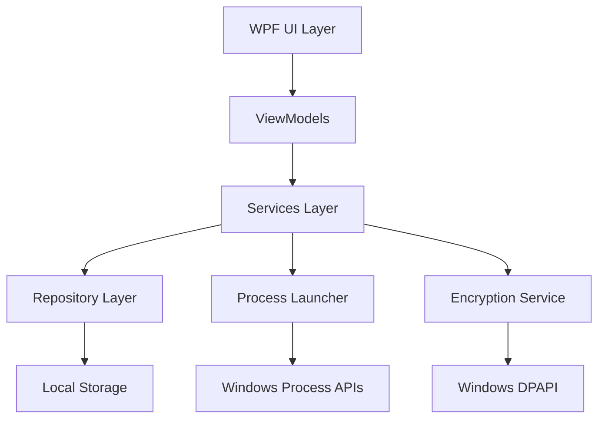

# Design Document

## Overview

The AD User Launcher is a WPF application built on .NET 9 that provides secure credential management and application launching capabilities. The application uses MVVM architecture pattern with secure credential storage via Windows Data Protection API (DPAPI) and process launching with alternate credentials using Windows APIs.

## Architecture

### High-Level Architecture



### Layer Responsibilities

- **UI Layer**: WPF Views with data binding to ViewModels
- **ViewModel Layer**: MVVM pattern implementation with INotifyPropertyChanged
- **Services Layer**: Business logic for credential management and process launching
- **Repository Layer**: Data persistence and retrieval operations
- **Encryption Service**: Secure credential encryption/decryption using DPAPI
- **Process Launcher**: Windows process creation with alternate credentials

## Components and Interfaces

### Core Models

#### ADAccount
```csharp
public class ADAccount
{
    public Guid Id { get; set; }
    public string DisplayName { get; set; }
    public string Username { get; set; }
    public string Domain { get; set; }
    public byte[] EncryptedPassword { get; set; }
}
```

#### ExecutableConfiguration
```csharp
public class ExecutableConfiguration
{
    public Guid Id { get; set; }
    public string DisplayName { get; set; }
    public string ExecutablePath { get; set; }
    public string? CustomIconPath { get; set; }
    public Guid ADAccountId { get; set; }
    public string? Arguments { get; set; }
    public string? WorkingDirectory { get; set; }
}
```

### Service Interfaces

#### ICredentialService
```csharp
public interface ICredentialService
{
    Task<IEnumerable<ADAccount>> GetAccountsAsync();
    Task<ADAccount> SaveAccountAsync(ADAccount account, string plainPassword);
    Task DeleteAccountAsync(Guid accountId);
    Task<string> DecryptPasswordAsync(ADAccount account);
}
```

#### IExecutableService
```csharp
public interface IExecutableService
{
    Task<IEnumerable<ExecutableConfiguration>> GetConfigurationsAsync();
    Task<ExecutableConfiguration> SaveConfigurationAsync(ExecutableConfiguration config);
    Task DeleteConfigurationAsync(Guid configId);
    Task<BitmapImage> GetIconAsync(ExecutableConfiguration config);
}
```

#### IProcessLauncher
```csharp
public interface IProcessLauncher
{
    Task<bool> LaunchAsync(ExecutableConfiguration config, ADAccount account, string password);
}
```

### ViewModels

#### MainViewModel
- Manages the main application state
- Coordinates between credential and executable management
- Handles application-level commands

#### CredentialManagementViewModel
- Manages AD account CRUD operations
- Handles password input and validation
- Provides commands for account management

#### ExecutableManagementViewModel
- Manages executable configuration CRUD operations
- Handles file browsing for executables and icons
- Provides commands for configuration management

#### LauncherViewModel
- Displays configured executables as clickable icons
- Handles launch operations
- Provides status feedback during launches

## Data Models

### Storage Schema

#### Configuration File Structure (JSON)
```json
{
  "adAccounts": [
    {
      "id": "guid",
      "displayName": "string",
      "username": "string", 
      "domain": "string",
      "encryptedPassword": "base64-encoded-bytes"
    }
  ],
  "executableConfigurations": [
    {
      "id": "guid",
      "displayName": "string",
      "executablePath": "string",
      "customIconPath": "string?",
      "adAccountId": "guid",
      "arguments": "string?",
      "workingDirectory": "string?"
    }
  ]
}
```

### Security Considerations

#### Credential Protection
- Passwords encrypted using Windows DPAPI with CurrentUser scope
- Encrypted data can only be decrypted by the same user on the same machine
- No plain-text passwords stored in memory longer than necessary
- SecureString usage for password handling in UI

#### Process Security
- Use Windows CreateProcessWithLogonW API for launching with alternate credentials
- Validate executable paths before launching
- Sanitize command-line arguments to prevent injection

## Error Handling

### Error Categories

#### Credential Errors
- Invalid AD credentials during launch
- Encryption/decryption failures
- Account not found errors

#### File System Errors
- Executable file not found
- Icon file not accessible
- Configuration file corruption

#### Process Launch Errors
- Insufficient privileges
- Process creation failures
- Authentication failures

### Error Handling Strategy

#### User-Facing Errors
- Display user-friendly error messages in UI
- Provide actionable guidance for resolution
- Log detailed errors for troubleshooting

#### Recovery Mechanisms
- Graceful degradation when icons cannot be loaded
- Fallback to default icons when custom icons fail
- Configuration backup and restore capabilities

## Testing Strategy

### Unit Testing Focus Areas

#### Service Layer Testing
- Credential encryption/decryption operations
- Configuration persistence and retrieval
- Icon extraction and caching

#### ViewModel Testing
- Command execution and state management
- Property change notifications
- Input validation logic

### Integration Testing

#### End-to-End Scenarios
- Complete credential management workflow
- Executable configuration and launch process
- Data persistence across application restarts

#### Security Testing
- Credential protection verification
- Process isolation validation
- Permission boundary testing

### Manual Testing

#### User Experience Testing
- UI responsiveness and feedback
- Error message clarity and helpfulness
- Icon display and interaction behavior

#### Security Validation
- Credential storage security verification
- Process launch with alternate credentials
- Data protection across user sessions

## Implementation Notes

### Technology Stack
- .NET 9 WPF application
- System.Text.Json for configuration serialization
- Windows API P/Invoke for process launching
- MVVM Community Toolkit for ViewModel base classes

### Performance Considerations
- Lazy loading of icons to improve startup time
- Async operations for file I/O and process launching
- Icon caching to reduce repeated file system access

### Accessibility
- Keyboard navigation support for all UI elements
- Screen reader compatibility with proper ARIA labels
- High contrast theme support

### Deployment
- Single executable deployment with self-contained runtime
- No external dependencies beyond .NET runtime
- Configuration stored in user's AppData folder